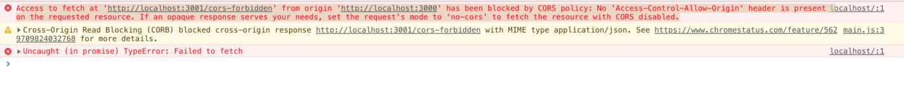

keywords: cors

--- 
### Cross-Origin Resource Sharing Cross-Origin-Resource (CORS)

#### 同源政策（same-origin policy）
>那麼跨來源請求是怎麼運作的呢？

主要是由兩個 Header 來做相對的存取控制，Request 當中的 Origin 和 Response 中的 Access-Control-Allow-Origin。

只要發送請求時的 Origin 和回應的 header 中 Access-Control-Allow-Origin 的值相同，或是Access-Control-Allow-Origin: * （代表允許任何網域存取資源），此時就會放寬 CORS 的限制，允許存取跨域資源。

如果不符合 CORS policy 的話，會顯示下列訊息：

### references:
  * [MDN-跨來源資源共用（CORS）](https://developer.mozilla.org/zh-TW/docs/Web/HTTP/CORS)
	* [和 CORS 跟 cookie 打交道](https://medium.com/d-d-mag/%E5%92%8C-cors-%E8%B7%9F-cookie-%E6%89%93%E4%BA%A4%E9%81%93-dd420ccc7399)