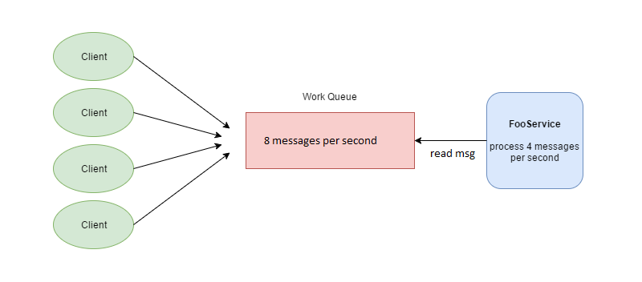

### Comparison 
* Message-based vs. Event-based
* Message-based System will have to deal with backpressure issue.

* websocket
  * websocket 在實體網路不穩定時，會有明顯的backpressure，導致buffer出塞爆，記憶體用量大增。
* message broker
 

### References:
[Backpressure in Message-Based System](https://clearmeasure.com/backpressure-in-message-based-systems/)