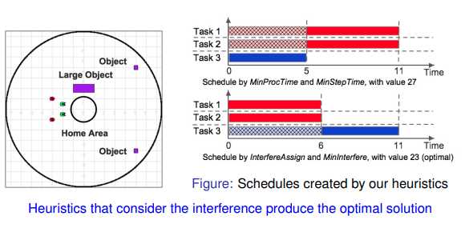

TODOs: 
1. Messages ROS2 <> NodeJS (roslib) , `<interfaces>`
   [v] Publish  
   [v] Subscibe  
   [ ] Service (https://docs.ros.org/en/foxy/Tutorials/Custom-ROS2-Interfaces.html)
   [ ] Action 

2. ROS language 
   [ ] cpp
   [ ] python

3. Write some testing cases by `testcafe`  (https://github.com/DevExpress/testcafe)

4. Documentation on README


##### Major

```txt
Reviews of rmf_demo project.
1. Task Queue in AMR level, not in Fleet level.
Description: The task queue should be fleet level, so that the task and/or resource allcation would be realized.
2. Traffic Editor is not user-friendly enough.
Description: Not so intuitive to use. 
3. Performance Issue.
Description: While the program(rmf_demo) is running, the memory size takes a lot.
4. Documentation
Description: Don't know how to apply the project into real scene.

This situation
emphasizes the importance of efficient task
allocation to get desired system performance.

Task allocation process should be realized to provide an
effective use of system resources by maximization
of overall system gain or by minimization of system
cost. 

1. Task Management. Should not be Task scheduler
The difference
Taxonomy 分類

Task scheduling
似乎 task 有執行時間的限制。


```

##### Minor
- [ ] plantuml template
- [ ] zsh
- [x] vscode git, Kraken, lazygit
- [x] xhost +/-local:root (Docker GUI)
- [x] Default gazebo model path
- [x] apt-search, add-apt-repository
- [x] snapd


docker, k8s robot maker 
k3s lightweight for rpi
ydlidar


```sh
$sudo apt-get -y install cmake build-essential curl cppcheck g++-8 libbenchmark-dev libgflags-dev doxygen ruby-ronn libtinyxml2-dev libtinyxml-dev software-properties-common libeigen3-dev qtdeclarative5-models-plugin

$sudo update-alternatives --install /usr/bin/gcc gcc /usr/bin/gcc-8 800 --slave /usr/bin/g++ g++ /usr/bin/g++-8 --slave /usr/bin/gcov gcov /usr/bin/gcov-8

etc/udev/rules.d 
```

---

### 受眾的資訊切入點。
細節描述，工作內容陳述、任務分配

下禮拜的 software proposal scenario的整合
前因，產品roadmap。
策略性的陳述。 
Demo 

Tech Day 討論
https://youtu.be/tixx0WYbAcw

---

action items:
* Thur. List all requests.
* lidar 角度的問題
* 開產品規格
* Tech / 商用表格 for web
Scheduling, Global 架構的產出。

結合測試，delivery的事項。
Robot aware
otto clear path


情境測試
- [ ] 列SQA

## To Discuss:
Communication between stateAggregator <-> AMRs
* ROS2
* DDS
Q1. Unified Protocols?
Q2. Conflicts with Robot-aware? 

v0.1
1. v ROS2 environment (ROS1/ROS2) docker file, turtlebot3. 
2. rmf_demo integeration into docker simulation 
3. ROS2 Navigation2 control simulation. larger map, 

v0.3
1. Task Schduler 
    BehaviorTree Engine Test	
2. Behavior Tree generation
3. How much is in progress.
4. [Test] Task Editor with UI


### WebUI 的討論
地圖顯示，必須有站點，顯示在地圖(可以先寫死)。
啟動時，initial pose 機器人的位置。

加入task queue的欄位
報表資料，加上filter顯示已完成資料，不同機器人的紀錄。


---

### procedure of making robot (Software Verification)
1. autonomous part
2. V-shape develope

the most chanllenging part: verification
customer side.

customer will change the env. settings
on customer side;

remotely
fail-trial verification
data-collection.
simulation testing > we do it.

create software arch.
* new feature
* need to fit the arch.
* scalable

UI/UX analysis
configuration and combination

during usabilty test

internally > customer side
and new requirements come in from customers


Design and Developement. 
PC / Controller have define the specs. and how to integrate them.
The computing ability estimation

---

### nVidia Issac
rack are simliar to docking 
lidar, corners
speed, performance, good enough?
ISSAC 
rack docking 

Robot projects:
Carter (On-demand design)
Kaya (following, recognized small things)

Simulation on workstation
deploy to xavier.

Hardware in the loop.

visualization tool, webUI
sight UI -> rviz

Deep stream integration by vision streaming

*** Trajectory planning LQR
Linear Quadratic Regulator (LQR)

ISSAC SIM

Simulation tools? Gazebo? Unity
* 需要具備何技能？ Unity Backend replacement.

bridge based on ROS
多數 GPU 優化（閉源）, 
Transport Robot(BMW)
https::/developer.nvidia.com/gtc/

ISSAC 
node 與 node 間的跨機？

[nvidia bridge] road map open source 
Jetson Xavier support DMA? 相關技術？

