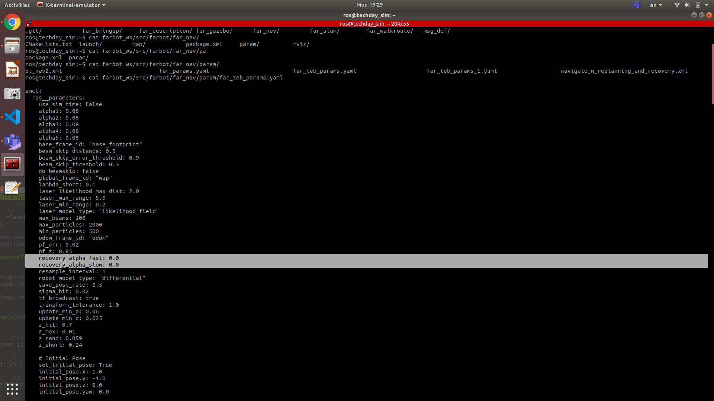
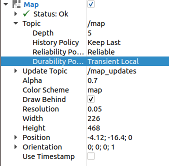
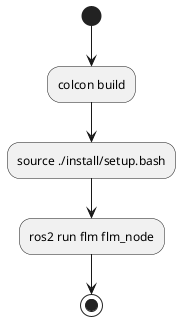
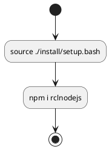

### ROS　Map Origin
on the left bottom.
Ref
https://answers.ros.org/question/322919/to-understand-the-concept-of-origin-field-from-map_server/

### memo:
1. 程式邏輯
2. 函式的功用
3. 語法的替代性(相似/差異)


### quick note
Ref1:
https://unix.stackexchange.com/questions/54953/error-message-id-cannot-find-name-for-group-id-after-logging-in
$vim /etc/group

Ref2: 
http://wiki.ros.org/teleop_twist_keyboard (noetic)
##Installing
sudo apt-get install ros-noetic-teleop-twist-keyboard
## Running
rosrun teleop_twist_keyboard teleop_twist_keyboard.py

Ref3:
https://answers.ros.org/question/214157/how-do-i-install-stage-and-stage_ros/


sudo docker run -itd \             
    --privileged \
    --network host \
    --env="DISPLAY" \
    --env="QT_X11_NO_MITSHM=1" \
    --volume="/dev:/dev:rw" \
    --volume="/tmp/.X11-unix:/tmp/.X11-unix:rw" \
    --volume="$DIR/$1_ws:/home/ros:rw" \
    --hostname noetic \
    --add-host noetic:127.0.1.1 \
    --name my_noetic2 \
    ros:noetic


VALID CMD
installation todos:
1. vim
2. ros-noetic-stage-ros
3. byobu
4. tmuxp
5. subversion

features:
1. superuser


$sudo apt-get install ros-foxy-rviz2
$ros2 run rviz2 rviz2

#include "visualization_msgs/msg/interactive_markers.hpp"


### Life Cycle manager
https://navigation.ros.org/configuration/packages/configuring-lifecycle.html

### Read XML file
https://www.coder.work/article/3330277
http://www.cppblog.com/lynch/archive/2012/12/14/196249.html


### ROS Bridge
only support nodejs v12.18.4
v12.19.4 will fail

### timer_callback
'get_parameter' cannot put in constructor
should be put in timer_callback


### remap
Found remap rule 'amr_name:=merry'. This syntax is deprecated. Use '--ros-args --remap amr_name:=merry' instead.

[Passing ROS arguments to nodes via the command-line](https://index.ros.org/doc/ros2/Tutorials/Node-arguments/)

[ROS2 rcl YAML parameter parser](https://github.com/ros2/rcl/tree/master/rcl_yaml_param_parser)
[Using Parameters In A Class CPP](https://index.ros.org/doc/ros2/Tutorials/Using-Parameters-In-A-Class-CPP/)

### run env_builder script
```sh
# run in t1
$ros2 run env_builder env_builder_node

# run in t2 Map Server
$ros2 run nav2_map_server map_server --ros-args -p yaml_filename:=./simFLM.yaml

# run in t3  Map Trigger
$ros2 run nav2_util lifecycle_bringup map_server

# run in t4
$ros2 run rviz2 rviz2
```

### Message Interface
https://farobottech-my.sharepoint.com/:x:/p/hank_chen/EZieuIOk_SZBnVQZhCjbPxABXGMAPRmD0L8oIJis8Y38zA?e=L4EsYb


### ROS error message
```sh
CMake Error at CMakeLists.txt:20 (find_package):
  By not providing "Findgazebo_ros_pkgs.cmake" in CMAKE_MODULE_PATH this
  project has asked CMake to find a package configuration file provided by
  "gazebo_ros_pkgs", but CMake did not find one.

# Sol.
$rosdep update rosdep install --from-paths src --ignore-src -r -y --rosdistro eloquent
```

---

### Use rosbag to replay for ros topics
```sh
## record
$ros2 bag record -a
$ros2 bag record <topic1> <topic2> … <topicN>

## play
$ros2 bag play <bag_file>
$ros2 bag play -l topic_for_ui_1/
```

---

### byobu + tmuxp to launch multiple windows at once
```sh
# Use script
$byobu new-session tmuxp load --yes ./far_amr_ws/bootstrap/test.zsh.yaml 
$git push -u origin HEAD 
# Save password once for all
$git config --global credential.helper store
```

---

### Simple ROS2 node Template:
```cpp
#include <rclcpp/rclcpp.hpp>
#include <chrono>
#include <string>
#include <functional>

using namespace std::chrono_literals;

class ParametersClass: public rclcpp::Node
{
  public:
    ParametersClass()
      : Node("parameter_node")
    {
      // Alt 1 
      //this->declare_parameter("bt_xml", rclcpp::ParameterValue(std::string("hello")));
      // Alt 2 
      this->declare_parameter<std::string>("my_parameter", "world");
      this->get_parameter("my_parameter", parameter_string_);
      timer_ = this->create_wall_timer(
      1000ms, std::bind(&ParametersClass::respond, this));
    }
    void respond()
    {
      this->get_parameter("my_parameter", parameter_string_);
      RCLCPP_INFO(this->get_logger(), "Hello %s", parameter_string_.c_str());
    }
  private:
    std::string parameter_string_;
    rclcpp::TimerBase::SharedPtr timer_;
};

int main(int argc, char** argv)
{
  rclcpp::init(argc, argv);
  rclcpp::spin(std::make_shared<ParametersClass>());
  rclcpp::shutdown();
  return 0;
}
```

---

### Behavior Tree Issues:
Sol: Change the DDS version from RTPS to Cyclone, since the version in current AMR is cyclone.
btw, RTPS is from a small Spain company, with few engineers.

---

### ROS2 C++ node get paramters externally
```sh
$ros2 run far_task_runner far_task_runner_node --ros-args -p bt_xml:=~/Desktop/BT_ros2/bt_xml/far.xml
```

### ros2 amcl_bug:
should set the paramter to 0



### Sourcing inside the docker container
```sh
$source /opt/adlink/ros/navigation2_arm64_062513/install/setup.bash
$source install/setup.bash
```

#### ROS1/ROS2 Bridge
[ros2/ros1_bridge](https://github.com/ros2/ros1_bridge/blob/master/doc/index.rst)
[soss](https://soss.docs.eprosima.com/en/latest/index.html)
[RobotWebTools/ros2-web-bridge](https://github.com/RobotWebTools/ros2-web-bridge)

#### ROSLIBJS - Call service
```js
  // Subscribing to a Topic
  // ----------------------
  var listener = new ROSLIB.Topic({
    ros : ros,
    name : '/listener',
    messageType : 'std_msgs/String'
  });

  listener.subscribe(function(message) {
    console.log('Received message on ' + listener.name + ': ' + message.data);
    listener.unsubscribe();
  });

  // Calling a service
  // -----------------
  var addTwoIntsClient = new ROSLIB.Service({
    ros : ros,
    name : '/add_two_ints',
    serviceType : 'rospy_tutorials/AddTwoInts'
  });

  var request = new ROSLIB.ServiceRequest({
    a : 1,
    b : 2
  });

  addTwoIntsClient.callService(request, function(result) {
    console.log('Result for service call on '
      + addTwoIntsClient.name
      + ': '
      + result.sum);
  });

  // Getting and setting a param value
  // ---------------------------------
  ros.getParams(function(params) {
    console.log(params);
  });

  var maxVelX = new ROSLIB.Param({
    ros : ros,
    name : 'max_vel_y'
  });

  maxVelX.set(0.8);
  maxVelX.get(function(value) {
    console.log('MAX VAL: ' + value);
  });
```

[Class ServiceRequest](http://robotwebtools.org/jsdoc/roslibjs/r1/symbols/ROSLIB.ServiceRequest.html)

### rclnodjs
1. Have to source setup.bash for web and node. 
2. Have to **regenerate** the node_modules each time to do the modification

### vcs 
```sh
$sudo apt-get install python3-vcstool
```

### rosdep
```sh
$rosdep update
Command 'rosdep' not found, but can be installed with:

$sudo apt install python-rosdep2
$rosdep install --from-paths src --ignore-src -r -y
ERROR: your rosdep installation has not been initialized yet.  Please run:
    sudo rosdep init
    rosdep update

# colcon
$sudo apt install python3-colcon-common-extensions

# rosdep的sourcelist會timeout
$~/neuronbot2_ros2_ws$ rosdep install --from-paths src --ignore-src -r -y
ERROR: the following packages/stacks could not have their rosdep keys resolved
to system dependencies:
serial: No definition of [boost] for OS version [bionic]
Continuing to install resolvable dependencies...
#All required rosdeps installed successfully

$sudo apt-get install libboost-all-dev

#Before running simulation, should load gazebo env variable
$source /usr/share/gazebo/setup.sh
```

---

### Missing modules while Installing ros_tutorials packages
Issue:
  Error Msg: ModuleNotFoundError: No module named 'em'
Fix:
  $pip uninstall em
  $pip install empy

Issue: 
  Error Msg: ModuleNotFoundError: No module named 'catkin_pkg'
Fix:
  $pip install --user catkin_pkg
  $pip install --user rosdep rosinstall_generator wstool rosinstall six vcstools
  $pip install --user pydot

Issue: 
  Error Msg: ModuleNotFoundError: No module named 'lark'
Fix:
  $pip install lark_parser 

Issue: 
  Error Msg: ModuleNotFoundError: No module named 'numpy'
Fix:
  $pip install numpy 

---

### Errro Msg

```sh
$sudo make
E: Package 'python-rosdep' has no installation candidate
```
***walk around***
remove `python-rosdep` 

sh -c '. /etc/lsb-release && echo "deb http://mirror.sysu.edu.cn/ros/ubuntu/ $DISTRIB_CODENAME main" > /etc/apt/sources.list.d/ros-latest.list'

---

### Behavior Tree
* XML (for Data Binding)
* XSD: XML Schema Definition
* SAX: Simple API to XML

---

### Overview of Gazebo Plugin 
1. A plugin is a chunk of code that is compiled as a shared library and insert into the simulation
1. 6 types of plugins
    * world
    * Model
    * Sensor
    * System
    * Visual
    * GUI

#### How to build and use a plugin
1. download related lib
2. compose the code
3. compile the plugin (CMakeList)
```cmake
cmake_minimum_required(VERSION 2.8 FATAL_ERROR)

find_package(gazebo REQUIRED)
include_directories(${GAZEBO_INCLUDE_DIRS})
link_directories(${GAZEBO_LIBRARY_DIRS})
list(APPEND CMAKE_CXX_FLAGS "${GAZEBO_CXX_FLAGS}")

add_library(hello_world SHARED hello_world.cc)
target_link_libraries(hello_world ${GAZEBO_LIBRARIES})
```
4. Export
```sh
$export GAZEBO_PLUGIN_PATH=${GAZEBO_PLUGIN_PATH}:~/gazebo_plugin_tutorial/build
```

---

**Usage**
1. Add in XML tag
2. gzserver
3. check the result

#### Change prefix
[Changing tf_prefix for a gazebo plugin](https://answers.ros.org/question/227074/changing-tf_prefix-for-a-gazebo-plugin/)

#### How to write a ROS2 Launch file
[ROS2 Launch System](https://design.ros2.org/articles/roslaunch.html)
[ROS2 Design](https://design.ros2.org/)

---

### rosdep 功用
1. What: A command-line tool for installing system dependencies
2. Install
```sh
$sudo pip install -U rosdep
```
3. Initial
```sh
# Need to be called only once after installation
$sudo rosdep init
``` 
---

### colcon build by relative path parameter
```
--merge-install
```

### ROS2 add launch folder and files

```cmake
install(DIRECTORY launch
  DESTINATION share/${PROJECT_NAME})
```

### Install Nav2 on foxy docker image
```sh
$sudo apt install ros-foxy-navigation2
```

### ROS2 Namespace

#### By Terminal Command
```sh
$ros2 run bt_ros2 bt_ros2 --ros-args -p bt_xml:=./bt_xml/far.xml --ros-args -r __ns:=/fb_1
```

#### By C++ Programming
```cpp
node_ = rclcpp::Node::make_shared(<node_name>, <namespace>);
node_ = rclcpp::Node::make_shared("nav2_client", "fb_1");
```

---

#### Execute Gazebo
```sh
$export TURTLEBOT3_MODEL=${TB3_MODEL}
$ros2 launch turtlebot3_gazebo turtlebot3_world.launch.py
```

#### Execute Navigation
```sh
$export TURTLEBOT3_MODEL=${TB3_MODEL}
# turtlebot3 map location
$cd /home/ros/turtlebot3_ws/src/turtlebot3/turtlebot3/turtlebot3_navigation2/map
$ros2 launch turtlebot3_navigation2 navigation2.launch.py use_sim_time:=True map:=./map.yaml
```

#### Execute Navigation in ROS1
```sh
$export TURTLEBOT3_MODEL=${TB3_MODEL}
$roslaunch turtlebot3_navigation turtlebot3_navigation.launch map_file:=$HOME/map.yaml
```

#### Quick Start
```sh
# Pre-requisite
$source /opt/ros/eloquent/setup.bash
$source ~/neuronbot2_ros2_ws/install/local_setup.bash

# t1:Gazebo
$os2 launch neuronbot2_gazebo neuronbot2_world.launch.py world_model:=techday_world.model

# t2:Rviz
$os2 launch neuronbot2_nav bringup_launch.py map:=$HOME/building_editor_models/techday_map.yaml open_rviz:=true use_sim_time:=true
```

---

### Map Service

#### 運行map server
**Map的名稱不能有**<span style="color:red">底線、波浪符號</span>!!!
```sh
$ros2 run nav2_map_server map_server __params:=map.yaml
#Trigger
$ros2 run nav2_util lifecycle_bringup map_server
```

[Adlink ROS2 Nav](https://github.com/Adlink-ROS/neuronbot2/tree/eloquent-devel)

#### Map Service Update
```sh
# Foxy distro.
## <terminal 1>
### yaml_filename should be absolute directory
$ros2 run nav2_map_server map_server --ros-args -p  yaml_filename:=<yaml_filename>

## <terminal 2>
### Trigger
$ros2 run nav2_util lifecycle_bringup map_server

## <terminal 3>
$ros2 run rviz2 rviz2
### parameters list
Topic: /map
History Policy: Keep Last
Reliability: Reliable
Durability: Transient Local
```



Note:
ROS2 need to check the source code often to prevent from code change.

### Problems:
```sh
ros@foxy:~/techday_map$ ros2 run rviz2 rviz2
QStandardPaths: XDG_RUNTIME_DIR not set, defaulting to '/tmp/runtime-ros'
[INFO] [1605782953.732485131] [rviz2]: Stereo is NOT SUPPORTED
[INFO] [1605782953.732577377] [rviz2]: OpenGl version: 4.6 (GLSL 4.6)
[INFO] [1605782953.749447248] [rviz2]: Stereo is NOT SUPPORTED
[INFO] [1605798959.056131010] [rclcpp]: signal_handler(signal_value=2)
```

#### Quick Start
```sh
# t1:Launch Mememan world
$source /opt/ros/eloquent/setup.bash
$source ~/neuronbot2_ros2_ws/install/local_setup.bash
$ros2 launch neuronbot2_gazebo neuronbot2_world.launch.py world_model:=mememan_world.model

# t2:Launch Navigation 2
$source /opt/ros/eloquent/setup.bash
$source ~/neuronbot2_ros2_ws/install/local_setup.bash
$ros2 launch neuronbot2_nav bringup_launch.py map:=$HOME/neuronbot2_ros2_ws/src/neuronbot2/neuronbot2_nav/map/mememan.yaml open_rviz:=true use_sim_time:=true

# t3:Map Service
# ROS2 eloquent / ROS1
$ros2 service call /map nav_msgs/srv/GetMap
# ROS2 foxy
$ros2 service call /map_server/map nav_msgs/srv/GetMap
```

---

```sh 
$ros2 interface show <type_name>.srv
$ros2 service type <service_name>
```

#### Make sure the ID consistent
$echo $ROS_DOMAIN_ID
必須一致

---

## Dashboard Messages

Q: 2 actively report timing to UI
1. send req
2. any update from AMR.


Q: task id
A: from UI, gen id

Q: task number counter on webUI?
Q: task status without complete?


### S-sub Foxconn duty
1. generate task id.
2. count the number of completed tasks.
3. compare the difference of message from mission queue

### rmf_demo compliation Notice

#### Compilation
```bash
cd ~/rmf_demos_ws
source /opt/ros/eloquent/setup.bash
CXX=g++-8 colcon build --cmake-args -DCMAKE_BUILD_TYPE=RELEASE
# Compile specific package
CXX=g++-8 colcon build --cmake-args -DCMAKE_BUILD_TYPE=RELEASE --packages-select <pkg-name>
```

Have to notice that 
```bash
colcon build (--symlink-install) 
```
is <span style="color:red">INVALID</span>!!!


## Error Messages
```
ERROR: the following packages/stacks could not have their rosdep keys resolved
to system dependencies:
neuronbot2_bringup: No definition of [robot_pose_ekf] for OS version []
neuronbot2_slam: No definition of [gmapping] for OS version []
```

Sol:
```bash
$rosdep install --from-paths src --ignore-src --rosdistro=${ROS_DISTRO} -y --os=ubuntu:bionic
```
The assignment of the version of ubuntu is a **MUST**.

ref: https://github.com/OctoberWu/neuronbot2_multibot/blob/master/README.md


## Behavior Tree revision issues

ref: https://github.com/ros-planning/navigation2/issues/1686


### ROS nodes


### ROS web bridge

---

```bash
npm ERR! code ELIFECYCLE
npm ERR! errno 139
npm ERR! rclnodejs@0.15.0 postinstall: `node scripts/generate_messages.js`
npm ERR! Exit status 139
npm ERR! 
npm ERR! Failed at the rclnodejs@0.15.0 postinstall script.
npm ERR! This is probably not a problem with npm. There is likely additional logging output above.

npm ERR! A complete log of this run can be found in:
npm ERR!     /home/sc/.npm/_logs/2020-07-31T03_23_05_759Z-debug.log
```
### Solution:
```bash
$npm cache clean --force 
$rm -rf node_modules package-lock.json
$npm install
```
Error probably occurs at cache

### change node vesrion globally
```sh
$nvm alias default 6.1.0
```

---

### Default Gazebo path
The GAZEBO_MODEL_PATH environment variable, which is usually set by sourcing the setup.sh script , but is often incremented in several other ways.
The [model_paths] item in ~/.gazebo/gui.ini (this is how ~/model_editor_models and ~/building_editor_models are usually added)
The ~/.gazebo/models path is always checked

#### But you can designate it
```sh
$echo $GAZEBO_MODEL_PATH
$export GAZEBO_MODEL_PATH=$GAZEBO_MODEL_PATH:<path_to_your_model>
```
[gazebo default directory and can not insert model](https://answers.gazebosim.org//question/177/gazebo-default-directory-and-can-not-insert-model/)
[Gazebo Components](http://gazebosim.org/tutorials?tut=components&cat=get_started)