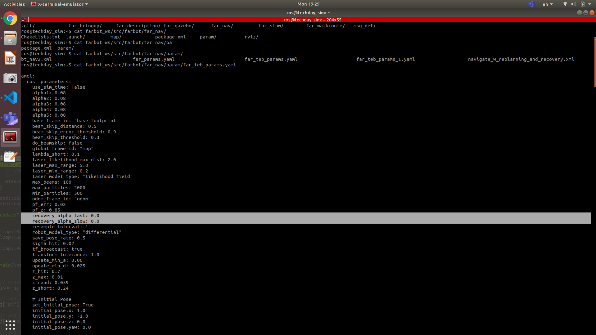

#### ME
* 殼跟lidar的干涉。腰帶加高5公分。
* 輪子的晃動，車體在移動過程中出現大異音。
* 車體啟動後，會歪斜偏移。
* 前導輪輪徑太小，進出電梯門需要加速，才不會卡在縫隙。
* 直線前進後退，車體有嚴重偏斜。
* 螺絲牙孔，建議改六角，替代十字，降低崩牙風險。
* 動力輪與導輪中心在同一力線上
* Lidar的傾斜角。彈簧 SICK 原廠轉接套件。

#### EE
* VCU運行一段時間後，會掛掉的現象。(VCU Robustness)
* 馬達煞車，扭力不足手轉會動。
* X-cube接的電壓不穩，電量不夠時會自動關機。(接穩壓器)  sol 電流不夠 5+5-
* real sense 416 的 driver(ROS2)
* 前(後) e-Stop DO NOT work.
* encoder value different 3cm/10m.

#### SOFTWARE
##### check the amcl params
$cat farbot_ws/src/farbot/far_nav/param/far_teb_params.yaml

#### REQUIREMENTs:
* 低速轉彎
* 走直線 (不內/外八)

