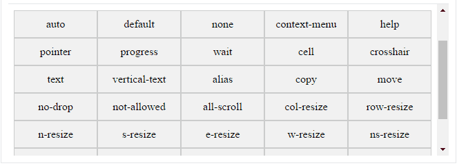

### JS 特殊屬性
### JSON Remove trailiing comma from last pair in JSON object 

JSON.parse()較為嚴謹。

* JSON 物件後面不能帶有逗號，會導致JSON.parse()失敗。


ex: 
```js
// fail case
  "sensor_front": {
    "enable": false,
    "state": false,
  }

// ok case
  "sensor_front": {
    "enable": false,
    "state": false
  }
```

JSON, however, disallows trailing commas.

ref: https://developer.mozilla.org/en-US/docs/Web/JavaScript/Reference/Trailing_commas

### hover cursor types
