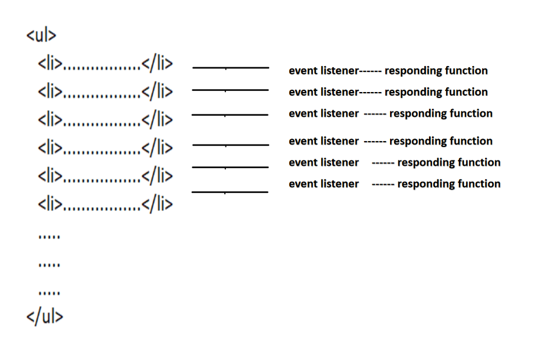
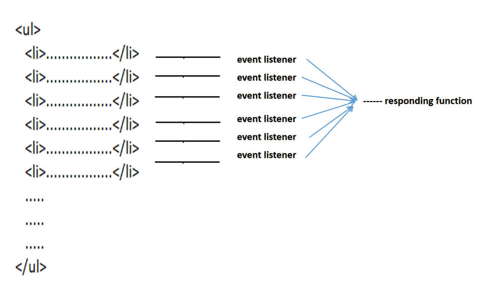

keywords: event-handler, event-binding, event-delegation

---
### quick note:
```html5
<button class="btn">Subscribe</button>
```
> element.addEventListener(type, addEventListener);

Solution 1:
```javascript
function clickHandler(event) {
   console.log('Button Clicked');
}
const btn = document.querySelector('.btn');
btn.addEventListener('click', clickHandler);
```

Solution 2: 
```javascript
const btn = document.querySelector('.btn');
btn.addEventListener('click', function(event){
   console.log('Button Clicked');
});
// or
btn.addEventListener('click', (event)=>{
   console.log('Button Clicked');
	 event.target // point to DOM element
});
```

Solution 3: 
> use bind() to implement


---
## overview
* binding events and functions are 2 factors 
* the target is to reduce the number of `EventListener` and `EventCallback`
* `event-bindings` CANNOT deal with multiple event-listeners and event callback functions.
* `event-delegation` is trying to reduce the number of binding event callback functions.
* In the references below, it also offers the way to reduce the number of event listeners and callbacks;

### event binding

```js
const customUI = document.createElement('ul');

for (var i = 1; i <= 10; i++) {
    const newElement = document.createElement('li');
    newElement.textContent = "This is line " + i;
    newElement.addEventListener('click', () => {
        console.log('Responding')
    })
    customUI.appendChild(newElement);
}
```

### event delegation 

```js
const customUI = document.createElement('ul');

function responding() {
    console.log('Responding')
}

for (var i = 1; i <= 10; i++) {
    const newElement = document.createElement('li');
    newElement.textContent = "This is line " + i;
    newElement.addEventListener('click', responding)
    customUI.appendChild(newElement);
}
```

#### references:
* [Event Delegation in JavaScript](https://www.geeksforgeeks.org/event-delegation-in-javascript/)