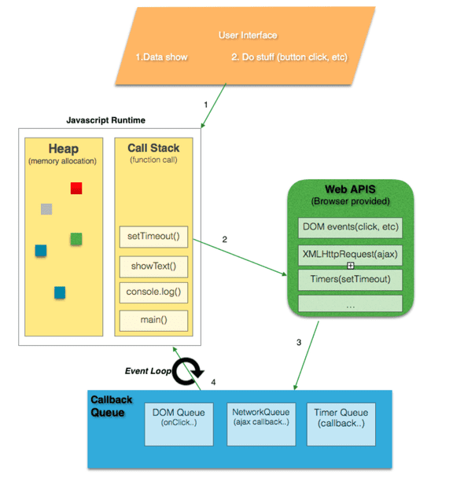

keywords: nodejs, event-loop, micro-task, macro-task

---
### Profile:
* Node.js 是一个基于 Chrome V8 引擎的 JavaScript 运行环境。
* Node.js 使用了一个事件驱动、非阻塞式 I/O 的模型，使其轻量又高效。
 
 
 

* Tell the differences between `Macro-task` and `Micro-task`

 ### references:
 #### event-loop
 * [Node.js 内置模块](https://ppambler.github.io/time-geekbang/02-NodeJS%E5%BC%80%E5%8F%91%E5%AE%9E%E6%88%98/02-%E6%8A%80%E6%9C%AF%E9%A2%84%E7%A0%94%E7%AF%87/04-built-in-module.html)
 * [我知道你懂 Event Loop，但你了解到多深？](https://yeefun.github.io/event-loop-in-depth/)
 * [Event Loop in NodeJS— Visualized](https://medium.com/@mmoshikoo/event-loop-in-nodejs-visualized-235867255e81)
 * [聊聊JavaScript非同步中的macrotask和microtask](https://www.gushiciku.cn/pl/25jF/zh-tw)
 
 #### add-on
 * [mapbox/node-cpp-skel](https://github.com/mapbox/node-cpp-skel)
		> About Skeleton for bindings to C++ libraries for Node.js using node-addon-api
 * [Node.js Addon Quickstart](https://nodeaddons.com/)
 * [Writing Native Node.js Modules](https://blog.risingstack.com/writing-native-node-js-modules/)
 * [A simple guide to load C/C++ code into Node.js JavaScript Applications](https://medium.com/jspoint/a-simple-guide-to-load-c-c-code-into-node-js-javascript-applications-3fcccf54fd32)