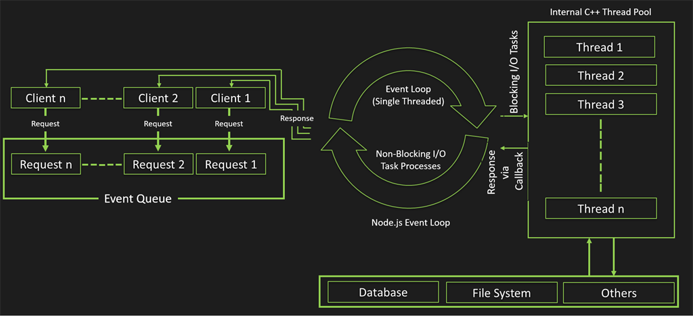

keywords: Promise,
---

### quick note: 
* Architecture:

* Synchronous <> Asynchronous
* Event-driven <> Multi-threading
* promise 用於異步調用，到ES6之後，改用async, await
* nodejs的架構，Event-Loop

setTimeout(), setInterval()
* 如何讓上述的函數，同步執行。
* 使用recursive + promise 使其為順序(依序)執行。
* Promise. resolve(成功), reject(失敗)
* Promise, Error-handling, 則是then(), catch()

##### node.js 的多執行緒, child_process, worker_thead
* 用於CPU-intensive的應用中。

##### CPU-bound
* 意指當CPU的計算能力越強(多核)，app的速度會越快。
* 相似的名詞，還有 IO-bound, memory-bound