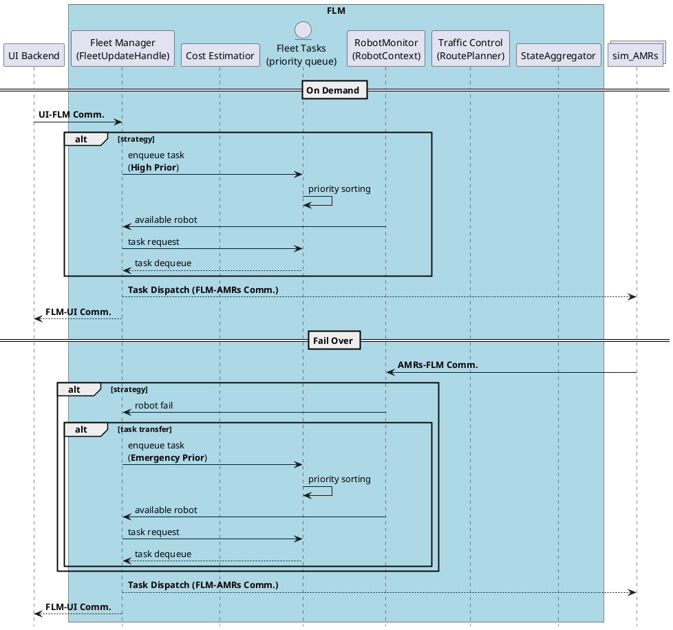

## full-fledged version:

```plantuml
@startuml
participant Backend as "UI Backend"

box "FLM" #LightBlue
participant Scheduler as "Fleet Manager\n(FleetUpdateHandle)"
participant estimator as "Cost Estimatior"
entity TaskQueue as "Fleet Tasks\n(priority queue)"

participant RobotMonitor as "RobotMonitor\n(RobotContext)"

participant traffic as "Traffic Control\n(RoutePlanner)"
participant StateAggregator 

end box

/'
box "traffic" #LightBlue
participant Planner
end box
'/

'box "Simulator\n(Needed)" #Pink
collections AMRs as "sim_AMRs"
'endbox


hide footbox

== On Demand ==
Backend->Scheduler: <b>UI-FLM Comm.</b> 
alt strategy 
Scheduler->TaskQueue : enqueue task\n(<b>High Prior</b>) 
TaskQueue->TaskQueue : priority sorting
RobotMonitor->Scheduler: available robot
Scheduler->TaskQueue: task request
TaskQueue-->Scheduler: task dequeue 
end alt
Scheduler-->AMRs: <b>Task Dispatch (FLM-AMRs Comm.)</b> 
Scheduler-->Backend: <b>FLM-UI Comm.</b> 

== Fail Over ==
AMRs->RobotMonitor:<b>AMRs-FLM Comm.</b>
alt strategy 
RobotMonitor->Scheduler: robot fail
alt task transfer
Scheduler->TaskQueue : enqueue task \n(<b>Emergency Prior</b>)
TaskQueue->TaskQueue : priority sorting
RobotMonitor->Scheduler: available robot
Scheduler->TaskQueue: task request
TaskQueue-->Scheduler: task dequeue 
end alt
end alt

Scheduler-->AMRs: <b>Task Dispatch (FLM-AMRs Comm.)</b> 
Scheduler-->Backend: <b>FLM-UI Comm.</b> 

@enduml
```