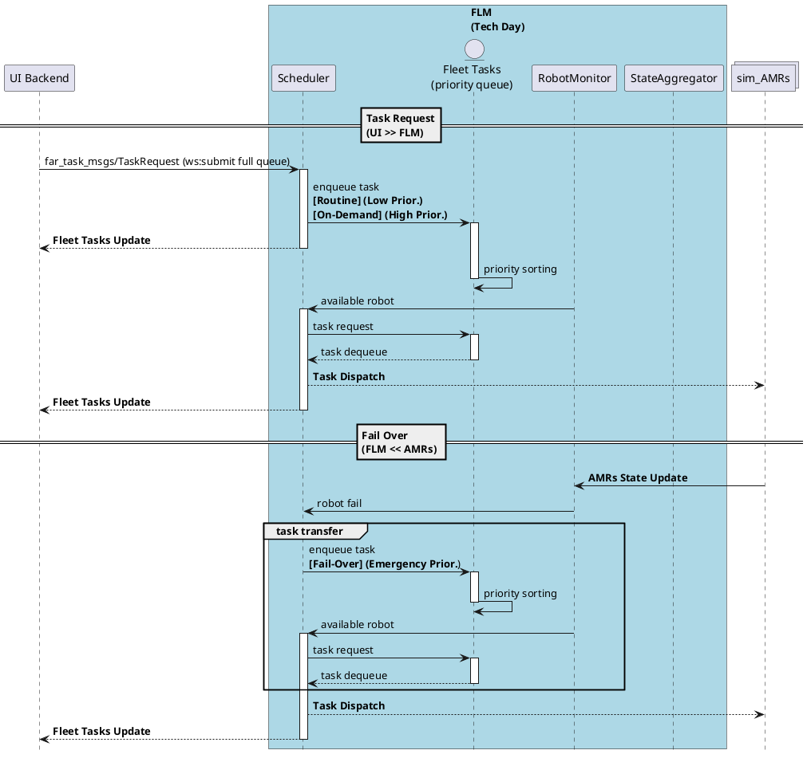

```plantuml
@startuml
participant Backend as "UI Backend"

box "FLM\n(Tech Day)" #LightBlue
participant Scheduler as "Scheduler"
entity TaskQueue as "Fleet Tasks\n(priority queue)"

participant RobotMonitor as "RobotMonitor"
participant StateAggregator 

end box

/'
box "traffic" #LightBlue
participant Planner
end box
'/

'box "Simulator\n(Needed)" #Pink
collections AMRs as "sim_AMRs"
'endbox


hide footbox


== Task Request\n(UI >> FLM) ==
Backend->Scheduler: far_task_msgs/TaskRequest (ws:submit full queue)
activate Scheduler
Scheduler->TaskQueue : enqueue task\n<b>[Routine] (Low Prior.)</b>\n<b>[On-Demand] (High Prior.) </b>
activate TaskQueue
Scheduler-->Backend: <b>Fleet Tasks Update</b> 
deactivate Scheduler
TaskQueue->TaskQueue : priority sorting
deactivate TaskQueue
RobotMonitor->Scheduler: available robot
activate Scheduler
Scheduler->TaskQueue: task request
activate TaskQueue
TaskQueue-->Scheduler: task dequeue 
deactivate TaskQueue
Scheduler-->AMRs: <b>Task Dispatch</b> 
Scheduler-->Backend: <b>Fleet Tasks Update</b> 
deactivate Scheduler

== Fail Over\n(FLM << AMRs) ==
AMRs->RobotMonitor:<b>AMRs State Update</b>
RobotMonitor->Scheduler: robot fail
group task transfer 
Scheduler->TaskQueue : enqueue task \n<b>[Fail-Over] (Emergency Prior.</b>)
activate TaskQueue
TaskQueue->TaskQueue : priority sorting
deactivate TaskQueue
RobotMonitor->Scheduler: available robot
activate Scheduler 
Scheduler->TaskQueue: task request
activate TaskQueue
TaskQueue-->Scheduler: task dequeue 
deactivate TaskQueue
end 

Scheduler-->AMRs: <b>Task Dispatch</b> 
Scheduler-->Backend: <b>Fleet Tasks Update</b> 
deactivate Scheduler 

@enduml
```